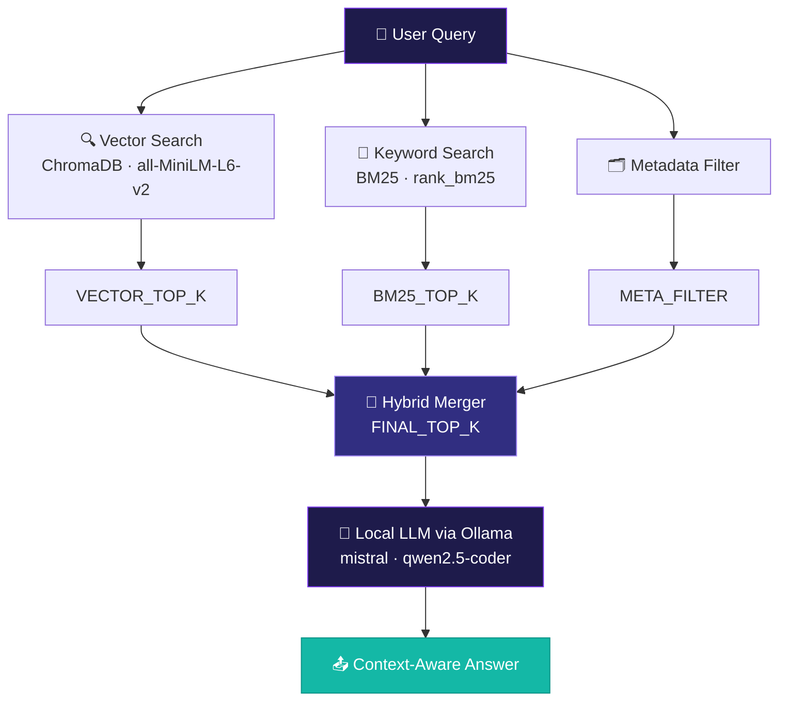
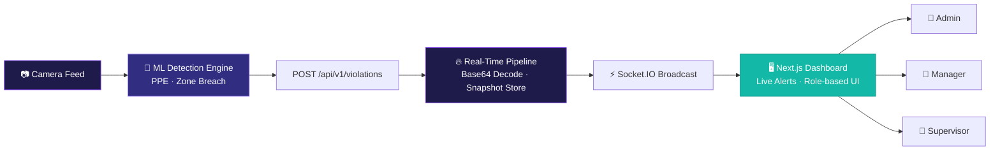
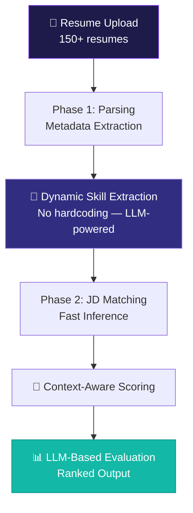
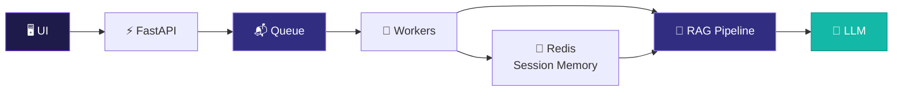

 

---

## 🧬 About Me

| | |
|:---|:---|
| 🎯 **Role** | AI Engineer · GenAI Builder · Backend Architect |
| 🔍 **Focus** | RAG Systems · LLMs · Real-time AI Pipelines |
| 🧠 **Mindset** | Systems thinker. Builder. Solver. |
| 🚀 **Superpower** | Production-grade AI — not just notebooks |
| ⚙️ **Currently** | Designing LLM-augmented pipelines |
| 📚 **Learning** | Multimodal RAG · Agent Frameworks |
| 🤝 **Available** | Collaborations & Open Source |

> **One-line summary:** _Building production-grade GenAI systems using RAG, local LLMs, and scalable backend architectures._

---

## 🚀 What I've Built

### 🧠 1. Hybrid RAG Systems — _My Core Strength_

> Production-style Retrieval-Augmented Generation pipelines — not toy projects.

**Key features built:**
- ✅ Follow-up query detection & topic anchoring
- ✅ Session-based context memory via **Redis** (`chat:session:{user_id}:{session_id}`)
- ✅ Intelligent routing — Casual vs Technical vs Follow-up queries
- ✅ Multi-stage retrieval pipeline
- ✅ Real-time chat UI with **Streamlit**
- ✅ Automotive domain QA & Policy/Document QA systems
- 🔜 LLM-based query rewriting *(next-level in progress)*

---

### 🌐 2. Safeguard AI — Full-Stack AI Monitoring Dashboard

> Real-world AI-powered safety monitoring system with real-time event pipelines.

---

### 📊 3. ATS — AI Resume Matcher System

> Intelligent hiring system. No hardcoded skill lists. Just LLM-powered understanding.

---

### ⚡ 4. Scalable AI System Architecture

> Designed for 10–20 concurrent users, offline-first AI, multi-worker queuing.

> 💡 **Bottleneck-aware:** LLM inference = slowest part → Worker scaling strategy applied.

---

## 🛠️ Tech Stack

### 🧠 AI / ML

**Models I work with:** `mistral` · `qwen2.5-coder` · `all-MiniLM-L6-v2`

---

### ⚡ Backend

---

### 🌐 Frontend

---

### 🗄️ Databases & ORMs

---

### 🧰 Dev Tools & Infra

---

## 🧠 AI / GenAI Knowledge Depth

| Domain | Topics | Status |
|--------|--------|--------|
| **RAG Architectures** | Naive · Hybrid · Tool-Augmented · Multimodal | ✅ Built + Learning |
| **Embeddings** | Semantic search · Sentence Transformers | ✅ |
| **Chunking Strategies** | Sliding window · Semantic chunking | ✅ |
| **Retrieval Evaluation** | Precision · Recall · MRR challenges | ✅ |
| **LLM Limitations** | Hallucination control · Context limits | ✅ |
| **Session Memory** | Redis-based · Per-user isolation | ✅ Built |
| **Offline-first AI** | Local LLMs · No cloud dependency | 🚀 Rare skill |

---

## 🎯 What Makes Me Different

| Trait | Details |
|-------|---------|
| 🏗️ **End-to-end builder** | Not just models — full systems from UI to DB to LLM |
| 🚀 **Offline-first AI** | Local LLMs, no cloud dependency — rare in the field |
| ⚡ **Real-time pipelines** | Socket.IO + async queuing for live AI events |
| 🧩 **System design first** | Think in bottlenecks, scale, and worker architecture |
| 🔍 **Hybrid retrieval** | Vector + BM25 — not just naive vector search |
| 🛠️ **Production mindset** | Debugged CORS, Prisma, Redis, API failures in real deployments |

---

## 📈 GitHub Stats

 

---

## 🔮 What's Next

| 🔜 Upcoming | Details |
|------------|---------|
| 🧠 LLM Query Rewriting | Rewrite ambiguous queries before retrieval |
| 🖼️ Multimodal RAG | Vision + Text retrieval pipelines |
| 🤖 AI Agent Frameworks | Tool-use, planning, memory-augmented agents |
| 📊 Evaluation Pipelines | RAGAs · TruLens benchmarking |
| 🚀 Performance Dashboards | Latency · Throughput · Retrieval quality metrics |

---

## 🤝 Connect With Me

---

**"I don't just use AI. I build the systems that power it."** 🚀

